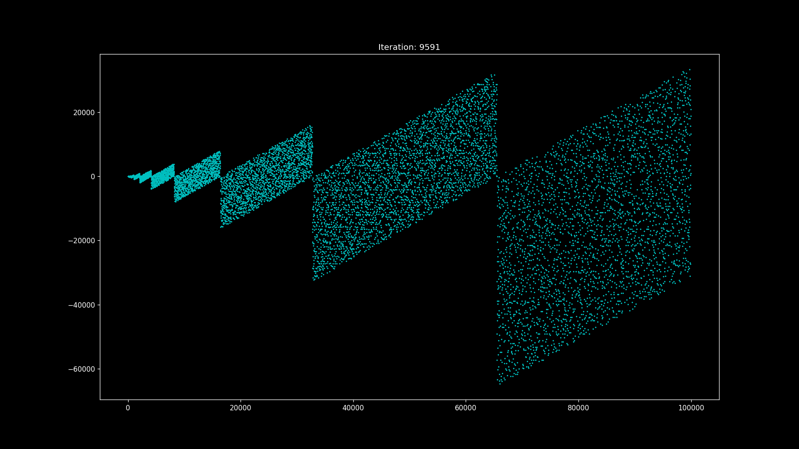

For all the prime numbers:
1.  convert to the binary form
2.  reverse the obtained binary number
3.  convert back to decimal
4.  subtract from the original number

When the result obtained is plotted, they repeat a pattern forming parallelograms.

